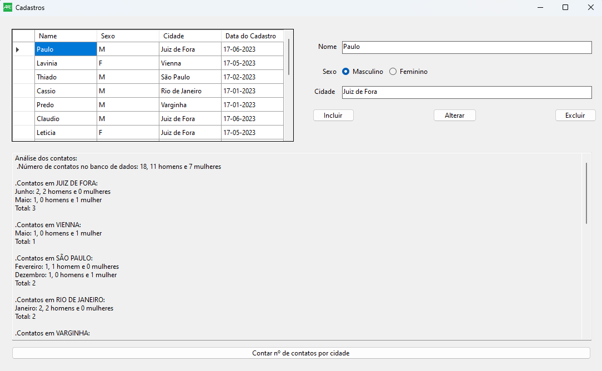
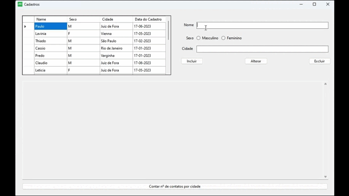
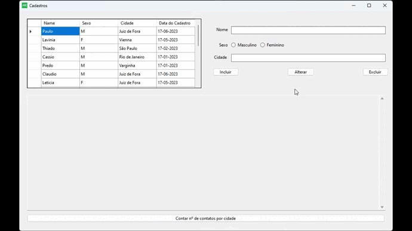
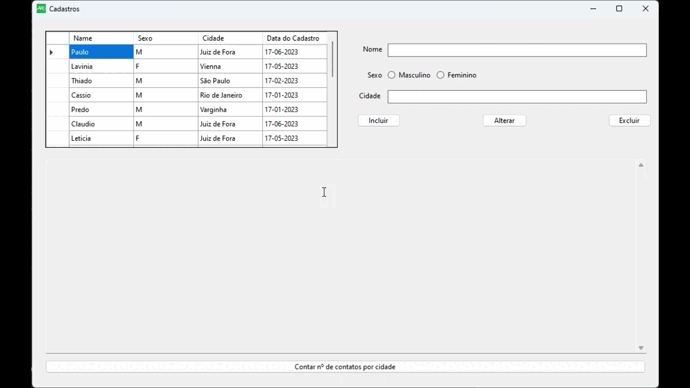
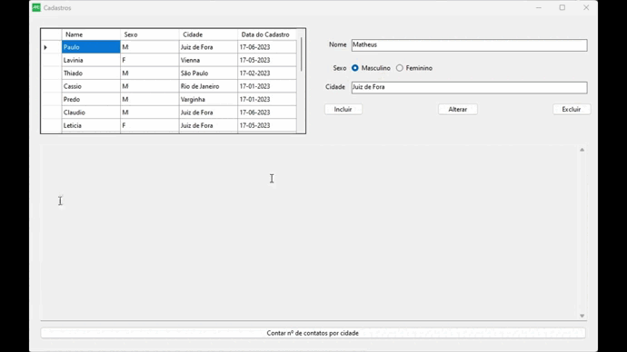

<h3 align="center"></h3>

<h1 align="center">Tela de Cadastro</h1>

<p align="center">
  <a href="#about">About</a> •
  <a href="#features">Features</a> •
  <a href="#installation">Installation</a> •
  <a href="#getting-started">Getting Started</a> •
  <a href="#more">More</a>
</p>


## About

O exercício consiste em escrever um programa de cadastro de dados, com as opções de inclusão, alteração e exclusão e uma função complementar para análise dos dados cadastrados. 

O banco de dados deverá conter somente uma tabela e esta tabela deve conter os campos NOME, SEXO, DATA (Dia, Mês, Ano), CIDADE e CODCONTATO.



Após cadastrar alguns dados iremos apertar o botão “Contar No de contatos por cidade” para que o programa preencha na caixa de texto o relatório com cada cidade cadastrada no banco de dados, número de contatos por mês e o total de contato em cada uma. Esta análise deve mostrar também o número total de contatos.

## Features

+ Tela para gerência de cadastros
+ Análise de cadastros por sexo e cidade

## Installation

+ Você poderá rodar o programa pelo Microsoft Visual Studio.
+ Eu também utilizei [Docker](https://www.docker.com) para implementação da imagem MySQL para o banco de dados.
+ Caso for utilizar do ```docker-compose up``` recomendo verificar o arquivo [docker-compose.yml](docker-compose.yml), para devidas configurações.
+ Caso utilizar de outra forma atualizar ```connstring``` no [Cadastro.cs](BDSImples/Cadastro.cs).
+ Criei um arquivo ```DadosCadastro.sql``` com os comandos para criar o banco de dados com dados inseridos na pasta ```assets```([ArquivoSQL](assets/DadosCadastro.sql)).

## Getting Started

Após criar o banco de dados e iniciar o aplicativo estará pronta para utilizar a tela de Cadastros

### Inserir

Para inserir precisamos completar todos os campos e clicar em **Inserir**. Caso falte algum campo haverá um aviso para completar.



### Alterar

Para alterar os dados deve-se selecionar um cadastro na tabela da esquerda alterar algo e então clicar em **Alterar**. Caso esteja vazio ou não selecione terá um aviso também.



### Excluir

Para excluir os dados basta selecionar qual cadastro quer excluir e então clicar em **Excluir**. Caso não selecione encontrara um aviso.



### Análise

Para realizar a análise os dados basta clicar no botão de **Contar nº de contatos por cidade**.




## More

Exercício para a vaga de Estágio em TI na AuE Software

+ Paulo Henrique dos Santos Eiterer
+ Email: pheiterer@hotmail.com
+ Telefone: (32) 9 9927-8251
